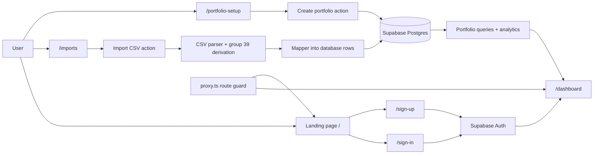
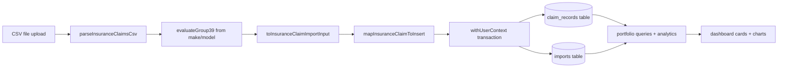

# RiskAtlas Project Overview

This document is a presentation guide for the current codebase. It explains what the app does,
where each feature lives, and how the pieces connect from the browser all the way to Supabase and
Postgres.

It reflects the current branch state, including the polished landing page, sign-in and sign-up
experience, import flow, portfolio setup flow, dashboard analytics, route protection, and the
shared visual system.

## 1. Product Goal

RiskAtlas is a private insurance portfolio management app. A user creates an account, uploads a
CSV with insurance claim rows, saves portfolio definitions based on filters, and then uses a
dashboard to review totals, charts, and breakdowns for the selected portfolio.

The app is designed to feel approachable for a non-technical insurance reviewer:
- The language avoids database terminology in the UI.
- The layout uses calm, premium-looking dark surfaces and soft color accents.
- The main flows are kept short and linear.
- The dashboard starts with a first-run gate so new users understand that the CSV import comes
  first.

## 2. High-Level Architecture

The application uses the Next.js App Router, Supabase Auth, Supabase Postgres, and Drizzle ORM.
Most user actions are performed through server actions, not through a separate REST API.

## 3. Route Map

| Route                                      | Purpose                                                                                                                          | Main files                                                                                                                                                                                                          |
|--------------------------------------------|----------------------------------------------------------------------------------------------------------------------------------|---------------------------------------------------------------------------------------------------------------------------------------------------------------------------------------------------------------------|
| `/`                                        | Public landing page. It adapts to auth state and shows either sign-in/sign-up or dashboard/sign-out actions.                     | `app/page.tsx`, `components/brand-badge.tsx`, `components/auth/sign-out-form.tsx`, `components/auth/signed-in-pill.tsx`                                                                                             |
| `/sign-in`                                 | Sign-in page with a focused auth card and a right-side explanation panel.                                                        | `app/sign-in/page.tsx`, `components/auth/auth-shell.tsx`, `components/auth/sign-in-form.tsx`                                                                                                                        |
| `/sign-up`                                 | Sign-up page with birth date validation and age rules.                                                                           | `app/sign-up/page.tsx`, `components/auth/auth-shell.tsx`, `components/auth/sign-up-form.tsx`, `lib/auth/validation.ts`                                                                                              |
| `/dashboard`                               | Main analytics workspace. Shows first-run onboarding if there are no imported claims yet, otherwise renders portfolio analytics. | `app/dashboard/page.tsx`, `components/dashboard/dashboard-first-run.tsx`, `components/dashboard/dashboard-shell.tsx`, `components/dashboard/portfolio-analytics.tsx`, `components/dashboard/portfolio-selector.tsx` |
| `/portfolio-setup`                         | Portfolio builder. Users save a named group of filters for later dashboard review.                                               | `app/portfolio-setup/page.tsx`, `components/app-page-shell.tsx`, `components/portfolios/portfolio-setup-form.tsx`, `components/portfolios/portfolio-list.tsx`                                                       |
| `/imports`                                 | CSV import page. Explains the required template, lets the user upload a CSV, and processes the file.                             | `app/imports/page.tsx`, `components/app-page-shell.tsx`, `components/imports/import-claims-form.tsx`, `lib/imports/process-insurance-claims.ts`                                                                     |
| `/templates/insurance_claims_template.csv` | Public CSV template download.                                                                                                    | `public/templates/insurance_claims_template.csv`                                                                                                                                                                    |

Unknown paths are redirected by the root `proxy.ts` so users do not land on a generic 404 page.

## 4. Main User Journey

### 4.1 Landing

The landing page is the public entry point. It explains the product in plain language and splits
the page into two zones:
- Left side: the main message and value proposition.
- Right side: a compact "How it works" panel.

If the user is signed out, the header shows:
- `Create account`
- `Sign in`

If the user is signed in, the header changes to:
- `Dashboard`
- `Signed in` pill with the email address
- `Sign out`

This makes the home page a shared starting point rather than a dead-end.

### 4.2 Sign In

The sign-in page uses the same visual language as the landing page. It keeps the form simple:
- email
- password

The form submits through a server action. If the user is already authenticated, the page redirects
to `/dashboard`.

### 4.3 Sign Up

The sign-up flow is intentionally stricter than a normal demo app:
- the user must enter a full name
- the birthdate must be typed in `mm/dd/yyyy`
- the birthdate must be between 18 and 100 years old
- the password must meet the minimum length requirement

The birthdate field is client-side formatted as the user types. It only accepts digits and
inserts the slashes automatically.

### 4.4 First Run Dashboard

If a signed-in user has no imported claims yet, `/dashboard` does not show the analytics view.
Instead, it shows a first-run gate that tells the user the next step is to upload the CSV.

That page is important because it makes the workflow obvious:
1. import the CSV
2. then create portfolios
3. then use the dashboard

The call-to-action is also disabled when the user has not uploaded a CSV yet, so the interface
nudges the user into the right sequence.

### 4.5 Import Flow

The imports page is the first real data entry point. It explains:
- what file format is expected
- where to download the template
- that the import is checked before anything is stored

The actual upload is handled by a server action that:
- validates the file type
- reads the CSV text
- parses and validates the headers
- derives the `_c39` field from make/model
- writes the import record and claim rows in a transaction

### 4.6 Portfolio Setup

Portfolio setup is the user-facing filter builder. The user picks:
- policy state
- policyholder gender
- incident state
- car brand
- incident year
- claim amount limit

The user gives the group a name, saves it, and the dashboard can later reopen the same saved
filter definition.

Saved portfolios are shown below the form so the user sees the result immediately.

### 4.7 Dashboard

The dashboard is the main analytical surface. It does not change the URL when the portfolio
changes. Instead, the selected portfolio is handled as internal state, which keeps the page cleaner
and easier to explain in a demo.

The dashboard includes:
- summary cards
- a saved portfolio selector
- monthly and yearly trends
- a claim mix pie chart
- state, gender, and make breakdowns
- a recent-claims list

The first saved portfolio is selected by default.

## 5. Data Flow

The pipeline is deliberately layered:
- The CSV parser validates structure and converts raw strings into typed rows.
- The mapper converts the parsed row into the Drizzle insert shape.
- The transaction wrapper scopes the database session to the current user.
- The dashboard queries only read the signed-in user's data.

## 6. Authentication and Session Handling

### Server-side auth

Auth is handled by Supabase Auth through server-side helpers:
- `lib/supabase/server.ts` creates a server Supabase client from cookies.
- `getCurrentUser()` returns the current user or `null`.
- Pages use that helper to redirect signed-out visitors to `/sign-in`.

### Route/session proxy

The root `proxy.ts` acts as the request guard:
- it refreshes the Supabase session
- it allows known app routes through
- it redirects unknown URLs back into the app

Current behavior:
- signed-in users with an unknown URL are redirected to `/dashboard`
- signed-out users with an unknown URL are redirected to `/`

That means a typoed URL never lands on a plain 404 screen.

### Signed-in visual cue

The shared `SignedInPill` component appears in the header on signed-in surfaces. It shows:
- a green live dot
- the text `Signed in`
- the current email address

This is a small but important reassurance for non-technical users.

## 7. Database Model

The database schema lives in `lib/db/schema.ts` and is mirrored by the Supabase migration in
`supabase/migrations/20260611162449_new-migration.sql`.

### Tables

| Table           | Purpose                                                         |
|-----------------|-----------------------------------------------------------------|
| `portfolios`    | Stores the saved portfolio name and its filter JSON.            |
| `imports`       | Stores each uploaded CSV import run and its processing status.  |
| `claim_records` | Stores the normalized insurance claim rows from the CSV import. |

### Important fields

#### `portfolios`
- `user_id`
- `name`
- `description`
- `filters` JSON
- timestamps

#### `imports`
- `user_id`
- `file_name`
- `status`
- `total_rows`
- `processed_rows`
- `failed_rows`
- `error_summary`
- timestamps

#### `claim_records`
- user and import linkage
- policy fields
- incident fields
- claim amount fields
- vehicle fields
- gender and fraud fields
- derived `_c39` boolean

### Why `_c39` exists

The `_c39` field is not typed by the user. It is derived from the car make/model pair using the
Group 39 lookup data in `lib/data/insurance-group-39.ts`.

That file contains the normalized make/model pairs that belong to the insurance group 39 list.
The parser checks the imported row and stores `_c39` as a boolean in the database.

## 8. Row-Level Security and User Scoping

The Supabase migration enables row-level security on all three user-facing tables:
- `portfolios`
- `imports`
- `claim_records`

Each table has:
- select policy
- insert policy
- update policy
- delete policy

The rules all check `user_id = auth.uid()`.

The app also scopes server-side database work through `withUserContext()` in `lib/db/index.ts`.
That helper sets the JWT claim values inside the transaction so Drizzle queries and RLS both see
the same authenticated user context.

This is the key guarantee that keeps one user's data isolated from every other user.

## 9. Import Pipeline

The CSV import flow is one of the most important vertical slices in the app.

### File format

The import expects the reviewer CSV format exactly. The parser validates:
- the headers
- the row structure
- the numeric fields
- the derived `_c39` handling

The parser:
- strips BOM characters
- supports quoted values
- splits rows manually
- converts numeric columns into numbers
- rejects unexpected headers

### Processing steps

1. The user uploads a `.csv` file.
2. `app/actions/imports.ts` verifies the file exists and is the right type.
3. The CSV text is read on the server.
4. `lib/imports/process-insurance-claims.ts` parses the file and creates the import record.
5. Each row is mapped into the `claim_records` table.
6. The import status is marked `completed`.
7. The dashboard and imports page are revalidated.

### Error handling

If the CSV format is wrong, the app returns a structured validation error instead of breaking.
If the database insert fails, the action catches the error and returns a safe message.

## 10. Portfolio Setup Flow

The portfolio setup experience is built around a saved filter definition.

### Form inputs

The form collects:
- portfolio name
- policy state
- policyholder gender
- incident state
- car brand
- incident year
- claim amount under a limit

### What happens on save

1. The server action validates the form with Zod.
2. The current user is resolved from Supabase Auth.
3. The filters are normalized into a JSON object.
4. A row is inserted into `portfolios`.
5. The portfolio setup page and dashboard are revalidated.

### Saved portfolio list

The `PortfolioList` component shows the saved portfolio name and a compact summary of the
criteria. This gives the reviewer immediate feedback that the group was saved successfully.

## 11. Dashboard Analytics

The dashboard is split into two parts:
- the portfolio selector and summary area
- the analytics panel

### Portfolio selection

`PortfolioSelector` is a client component that:
- shows the saved portfolios
- lets the user switch between them
- displays the active filter chips
- shows when the portfolio was created

The selected portfolio is handled in component state, so changing the selection updates the view
without changing the URL.

### Analytics panel

`lib/portfolio/analytics.ts` loads and aggregates the claim rows for the selected portfolio.
The panel then renders:
- total claim value
- total number of claims
- average claim value
- top state
- month trend chart
- year trend chart
- claim mix pie chart
- state breakdown bars
- gender breakdown bars
- make breakdown bars
- recent matching claims

The charts are custom SVG and layout components, not an external chart library. That keeps the
visuals lightweight and easier to control.

## 12. Shared UI System

The app uses a small set of shared shell components to keep the pages consistent.

| Component                                      | Role                                                        |
|------------------------------------------------|-------------------------------------------------------------|
| `components/brand-badge.tsx`                   | Reusable brand block with icon, app name, and subtitle.     |
| `components/site-footer.tsx`                   | Centered footer used across pages.                          |
| `components/app-page-shell.tsx`                | Two-column shell for the imports and portfolio setup pages. |
| `components/auth/auth-shell.tsx`               | Shared auth layout for sign-in and sign-up.                 |
| `components/dashboard/dashboard-shell.tsx`     | Main dashboard layout with selector and analytics.          |
| `components/dashboard/dashboard-first-run.tsx` | Onboarding dashboard shown before any CSV import exists.    |
| `components/auth/signed-in-pill.tsx`           | Visual sign-in indicator shown in headers.                  |
| `components/auth/sign-out-form.tsx`            | Server-action logout form.                                  |

### Base UI primitives

The project also has a light design system layer under `components/ui`:
- `button.tsx`
- `card.tsx`
- `input.tsx`
- `label.tsx`

These are the building blocks used by the forms and cards across the app.

## 13. Visual Design

The UI uses a consistent visual style:
- dark background gradients
- soft glass-like cards
- cyan, emerald, and amber highlights
- rounded shapes
- compact, premium form controls
- typography based on Geist

The style is defined primarily in:
- `app/globals.css`
- `components/ui/*`
- the page shell components

The goal is not just to look modern, but to feel calm and credible for an insurance workflow.

## 14. Loading States

The app has matching loading screens for the main workspace:
- `app/loading.tsx`
- `app/dashboard/loading.tsx`

They reuse the same brand block, background treatment, and card shapes so the transition feels
consistent instead of flashing a generic spinner page.

## 15. Important Files by Area

### App routes

| File                           | What it does                                           |
|--------------------------------|--------------------------------------------------------|
| `app/layout.tsx`               | Root layout, global fonts, metadata, and body wrapper. |
| `app/page.tsx`                 | Landing page with auth-aware header and product story. |
| `app/sign-in/page.tsx`         | Sign-in route and redirect logic.                      |
| `app/sign-up/page.tsx`         | Sign-up route and redirect logic.                      |
| `app/dashboard/page.tsx`       | Dashboard data loading and first-run decision.         |
| `app/portfolio-setup/page.tsx` | Portfolio setup page and saved portfolios list.        |
| `app/imports/page.tsx`         | CSV import page and template download.                 |

### Server actions

| File                        | What it does                            |
|-----------------------------|-----------------------------------------|
| `app/actions/auth.ts`       | Sign-up, sign-in, and sign-out actions. |
| `app/actions/imports.ts`    | CSV import action.                      |
| `app/actions/portfolios.ts` | Create portfolio action.                |

### Business logic

| File                                      | What it does                                               |
|-------------------------------------------|------------------------------------------------------------|
| `lib/auth/validation.ts`                  | Sign-up/sign-in schemas and birth date age checks.         |
| `lib/csv/insurance-claims.ts`             | CSV parser, header validation, and `_c39` derivation.      |
| `lib/data/insurance-group-39.ts`          | Insurance group 39 make/model lookup table.                |
| `lib/imports/process-insurance-claims.ts` | Import transaction and database writes.                    |
| `lib/portfolio/queries.ts`                | Portfolio and incident-year queries.                       |
| `lib/portfolio/analytics.ts`              | Portfolio filtering and analytics aggregation.             |
| `lib/dashboard/queries.ts`                | Counts the current user's claims, imports, and portfolios. |

### Database and auth helpers

| File                     | What it does                                               |
|--------------------------|------------------------------------------------------------|
| `lib/db/schema.ts`       | Drizzle schema for portfolios, imports, and claim records. |
| `lib/db/index.ts`        | Drizzle connection and user-scoped transaction helper.     |
| `lib/db/mappers.ts`      | Converts parsed CSV rows into Drizzle insert shapes.       |
| `lib/supabase/server.ts` | Server Supabase client and `getCurrentUser()`.             |
| `lib/supabase/proxy.ts`  | Session refresh and verified claim lookup for the proxy.   |
| `proxy.ts`               | Root route guard and redirect behavior for unknown paths.  |

### Shared components

| File                                             | What it does                                             |
|--------------------------------------------------|----------------------------------------------------------|
| `components/app-page-shell.tsx`                  | Shared two-column shell for imports and portfolio setup. |
| `components/auth/auth-shell.tsx`                 | Shared two-column shell for sign-in and sign-up.         |
| `components/dashboard/dashboard-shell.tsx`       | Main dashboard layout.                                   |
| `components/dashboard/dashboard-first-run.tsx`   | Onboarding gate for new users.                           |
| `components/dashboard/portfolio-selector.tsx`    | Saved portfolio selector and active filter summary.      |
| `components/dashboard/portfolio-analytics.tsx`   | Dashboard charts and metric cards.                       |
| `components/portfolios/portfolio-setup-form.tsx` | Portfolio creation form.                                 |
| `components/portfolios/portfolio-list.tsx`       | Saved portfolios list below the setup form.              |
| `components/imports/import-claims-form.tsx`      | CSV upload form.                                         |
| `components/brand-badge.tsx`                     | Reusable RiskAtlas logo block.                           |
| `components/site-footer.tsx`                     | Reusable footer.                                         |
| `components/auth/sign-in-form.tsx`               | Sign-in form.                                            |
| `components/auth/sign-up-form.tsx`               | Sign-up form with masked birth date handling.            |
| `components/auth/sign-out-form.tsx`              | Sign-out form.                                           |
| `components/auth/signed-in-pill.tsx`             | Signed-in status indicator.                              |

## 16. Suggested Presentation Order

If you are presenting the app, this is the cleanest order:

1. Start on `/` and explain the product goal and the two auth-aware header states.
2. Open `/sign-up` and show the age validation and birthdate formatting.
3. Open `/imports` and explain the template, the exact CSV schema, and the `_c39` derivation.
4. Show `/portfolio-setup` and explain how portfolios are named and filtered.
5. Go to `/dashboard` and explain the first-run gate, the portfolio selector, and the charts.
6. Mention that the data is user-scoped through Supabase Auth, Drizzle transactions, and RLS.
7. Finish by showing that unknown URLs are redirected instead of exposing a generic 404.

## 17. Current Implementation Notes

- The dashboard portfolio selection is handled in the component state, not in the URL.
- The first saved portfolio is selected automatically.
- The CSV template is a public static file under `public/templates`.
- The app relies on server actions for auth, imports, and portfolio creation.
- The data layer is isolated per user through both application logic and database policy.
- The CSV import path currently includes logging to help trace import issues during development.

## 18. One-Sentence Summary

RiskAtlas is a polished, user-isolated insurance claims workspace where a user imports a standard
CSV, saves filter-based portfolios, and reviews the resulting analytics in a clean dashboard.